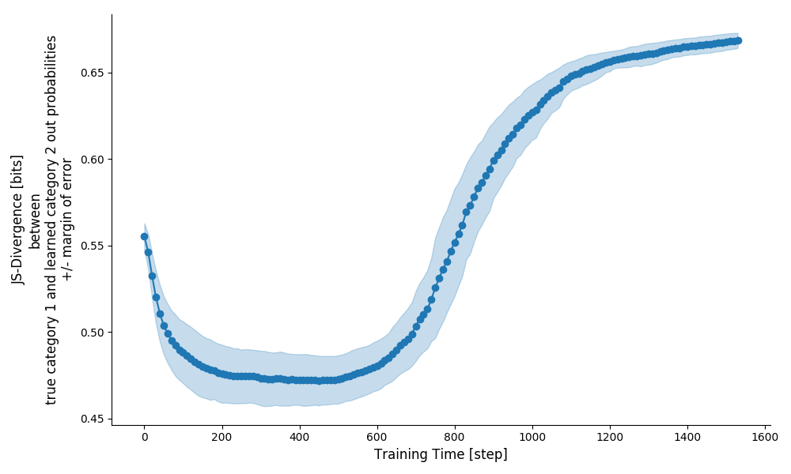

<div align="center">
 
</div>


Research code for understanding lexical category learning in the RNN.

## Background

### "Phantom" superordinate categories

The goal is to demonstrate that an RNN language model first represents members of different lexical categories as equally good members of "phantom" superordinate categories,
that are temporarily formed during training.
These "phantom" categories may map on to existing linguistic categories, but need not.

Understanding "phantom" categories should be of interest to researchers studying cognitive development,
 as they can potentially explain periods during which infants generalize linguistic knowledge based on some unobserved, induced abstract principle.
Also, understanding "phantom" categories can provide insight into the representational trajectory of word representations during RNN training.
Knowing that "phantom" categories emerge during RNN training can help explain how the RNN converges on the target categories, and how inductive biases might help constrain certain hypotheses.

### Progressive Differentiation & Maximum Entropy

The composition of "phantom" superordinate categories is best understood within the framework of maximum entropy.
A superordinate category in the RNN can emerge temporarily when a learned output probability distribution best captures a collection of individual next-word probability distributions,
 given the information gathered so far.
In this case, the cross entropy between a single next-word probability distribution is sufficient to capture the next-word probability distributions of all category members. 
As more information is gathered, evidence for differences in next-word probability distributions causes the single next-word probability distribution to no longer be optimal, and the category is split,
to reach optimality again.
This process continues, until the cross entropy is as small as it can be, and no further categories must be split.

### Hypothesis

Learning fewer categories takes fewer weight updates to converge to perfect categorization accuracy.
One explanation is that the fewer target categories the RNN is tasked to learn, the fewer intermediate superordinate categories must be acquired and discarded.
This sequence of acquisition and discarding may slow down learning when the number of target categories is large.

To demonstrate the presence of intermediate, emergent superordinate categories, one must track the evolution of learned next-word probability distributions.
The presence of a "phantom" category is confirmed if learned next-word probability distributions for words in one category temporarily converge towards similar next-word probability distributions for words in another category.

### Results

The presence of "phantom" categories was confirmed.
In the figure below, the presence of a temporarily stable state, indicating the RNN's discovery of a "phantom" category,
 is clearly visible between step 100-600.
The figure plots the JS divergence between two output probability distributions:
1. The true output probability distribution (based on knowledge of all the input) of a random word in one of 2 counterbalanced categories.
2. The learned output probability distribution of a random word in the second category, given all the information of the RNN until that point during training.

In the absence of "phantom categories", the RNN would converge directly on the correct category for each word,
but the results indicate that the RNN has found a temporary solution, in which a single category best explains the sequential regularities in the input until step 600.
Instead of arriving directly at the two target categories, the RNN shapes the two target categories from an intermittently stable "phantom" category.
This is indicated by the observation that the JS divergence between the two mutually exclusive categories temporarily drops.


<div align="center">
 
</div>


## Usage

To run the default configuration, call `entropic.job.main` like so:

```python
from entropic.job import main
from entropic.params import param2default

main(param2default)  # runs the experiment in default configuration
```

## Compatibility

Developed on Ubuntu 16.04 using Python3.7
