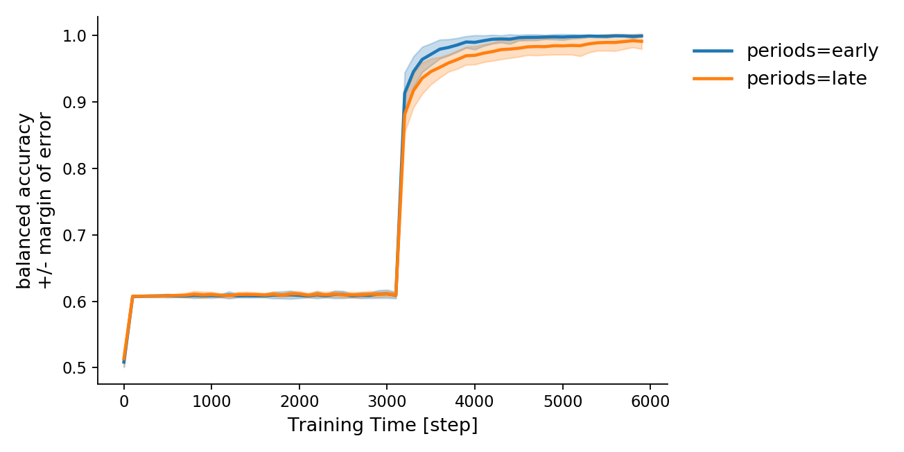

<div align="center">
 
</div>


Research code for understanding lexical category learning in the RNN.

## Background

### Learning from non-stationary input

Infants learn lexical subcategory structure in an online fashion, that is, from language that changes as they age.
Non-stationary is problematic, if positing lexical category acquisition as an RNN-like mechanism predicting upcoming words.
Having been exposed to one category structure during early training, the RNN cannot incorporate new examples,
 without re-organizing existing knowledge (also known as interference). 
 
There are at least two important research questions:
- 1.  How does the RNN learn new semantic sub-divisions of the noun category, 
  when it has already committed to a particular noun category structure given a set of early training examples?
- 2. How does the RNN integrate novel nouns into an existing encoding of the noun sub-category structure?

### Inductive bias

To answer the two questions above, researchers have to understand how the RNN assigns semantic (sub-) category information 
from the supervisory signal to the words in the input.
 Knowing nothing about human language, the RNN is maximally uncertain (entropic) about how to distribute the semantic category signal,
 and thus distributes the signal as thinly as possible across words in the input.
This is problematic if the semantic category signal originates not in the interaction between multiple words,
 but in a single word, such as the choice of noun. 
While a human may know how to assign semantic category signal to specific words, 
the RNN does not know to do this initially, and must learn this assignment as part of training.


### Sentence boundaries as inductive bias

Sentence boundaries, like periods, when left in the training data, 
can provide some inductive bias for concentrating semantic category information in the learned representations of nouns,
as opposed to members of other lexical categories which may be correlated with semantic category information but are not its primary source.

The period abstracts the noun-category, making it coherent, pulling nouns together in representational space. 
But it also makes the left-contexts of nouns useful predictors of the noun category. 
These left-contexts become useful later when new nouns are seen, because it makes them differentiate via the noun-category,
 and not via some higher superordinate category. 
An unseen word, in the absence of any context would be considered by the RNN to be part of the largest, most entropic category,
 and this assumption would be wrong for nouns. So, when new nouns occur in good noun contexts (learned early),
 they are differentiated via the noun-category, and their trajectory through representational space mimics nouns in general. 
This explains where the extra interference comes from when training in reverse age-order: Not having learned useful noun-contexts,
 when the RNN sees new nouns, it does not differentiate them with respect to the noun category,
 but with respect to some more entropic category, which is higher up in the subcategory tree that the RNN has learned to encode.
Because differentiation starts higher up in the tree, this affects a larger number of learned representations.
Rather than only having to re-organize nouns, the RNN is force to re-organize many more words, when a new noun is encountered.

<div align="center">
 
</div>

### Learning Dynamics

#### Without pseudo-periods

The animation below illustrates the differentiation of 4 categories by the RNN. 
Each category word is followed by mutually exclusive set of next-words.

<div align="center">
 
</div>

#### With pseudo-periods

In another simulation, each category word co-occurred with a pseudo-period with probability=0.1.
A pseudo-period is a word that indiscriminately follows words from any category.
Training on a corpus with pseudo-words included, changes the learning dynamics in an important way:
Before the 4 categories differentiate, their representations __first converge onto a common reference point__.

<div align="center">
 
</div>

### Implications

Knowing how lexical semantic category signal is distributed across words in the RNN's input,
 can help researchers develop inductive biases to distribute the semantic category signal in a way that is consistent with how humans  do it.
Staying uncommitted longer during early training should help category learning in situations where the input distribution is non-stationary,
such as training on child-directed speech in the order in which it is actually experienced by children on a developmental time-scale (1-6 first years of life).

## Usage

To run the default configuration, call `entropic.job.main` like so:

```python
from entropic.job import main
from entropic.params import param2default

main(param2default)  # runs the experiment in default configuration
```

## Compatibility

Developed on Ubuntu 16.04 using Python3.7
